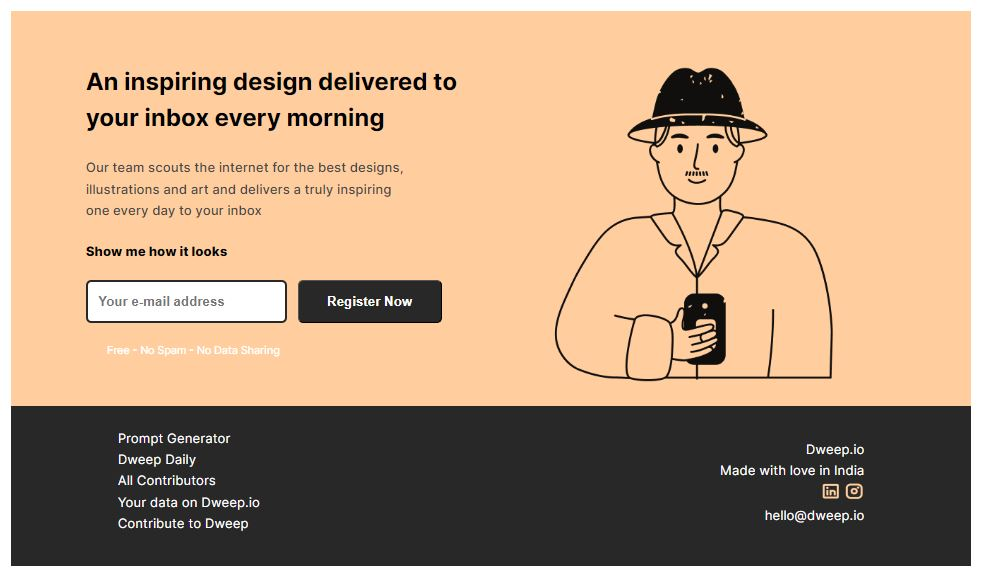

# Cuvette Mini Project 1 [Desktop Design]

## Description
This mini project, assigned by Cuvette, focuses on desktop design implementation utilizing HTML and CSS. The goal is to refine and enhance the user interface for desktop devices.

## Tech Stacks
- HTML
- CSS

## Implementation
- Semantic HTML
- CSS variables
- Google Fonts
- Flex
## Additional Resources

- [Figma Design](https://www.figma.com/file/yp9a2HtvhkaB428BjxWulV/HTML-%26-CSS?type=design&node-id=0-1&mode=design&t=S6HIMf3G8mM7tvc1-0)
- [Host Link](https://vinayak9669.github.io/Cuvette_Mini-project-1/)

## Screenshots

